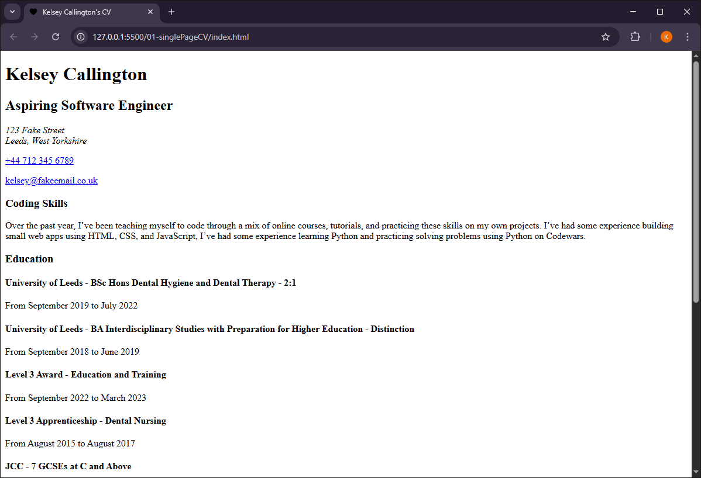

# Single Page CV

## Project Link
[https://roadmap.sh/projects/single-page-cv
](https://roadmap.sh/projects/single-page-cv)
## Goal
"The goal of this project is to teach you how to create a structured, single-page CV using only HTML. You will focus on laying out your education, skills, and career history in a clean, semantic manner. Styling will be addressed in a later project."

## Requirements
- Semantically correct HTML structure.
- Single-page layout with sections for education, skills, and career history.
- SEO meta tags in the head section.
- OG tags for better social media sharing.
- A favicon linked in the head section.

## Screenshot

